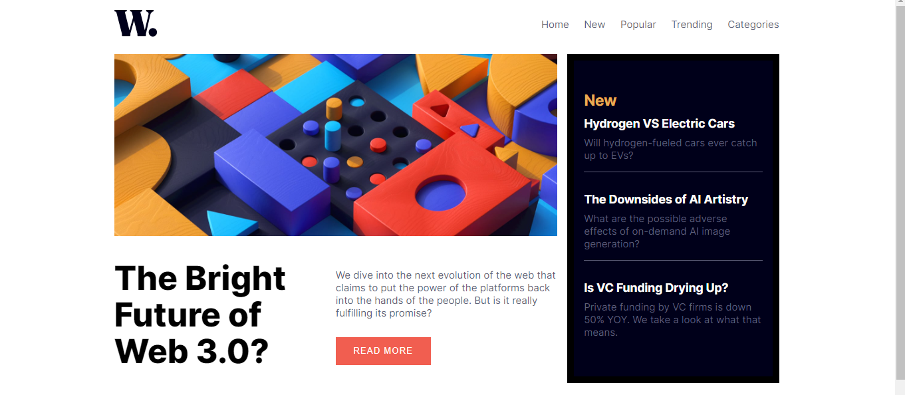

# Frontend Mentor - News homepage solution

## Table of contents

- [Overview](#overview)
  - [The challenge](#the-challenge)
  - [Screenshot](#screenshot)
- [My process](#my-process)
  - [Built with](#built-with)
  - [What I learned](#what-i-learned)
  - [Continued development](#continued-development)
- [Author](#author)

## Overview

### The challenge

Users should be able to:

- View the optimal layout for the interface depending on their device's screen size
- See hover and focus states for all interactive elements on the page

### Screenshot

## My process

### Built with

- Semantic HTML5 markup
- CSS custom properties
- Flexbox
- CSS Grid
- Mobile-first workflow

### What I learned

At first sight, the grid looks pretty easy unless you actually got on with it. It is actually awesome to work around it.

### Continued development

I feel like I am constantly improving and going forward am gonna pay much attention to layout patterns, animation, etc.

## Author

- George Asiedu - [@george5-star](https://www.frontendmentor.io/profile/george5-star)
